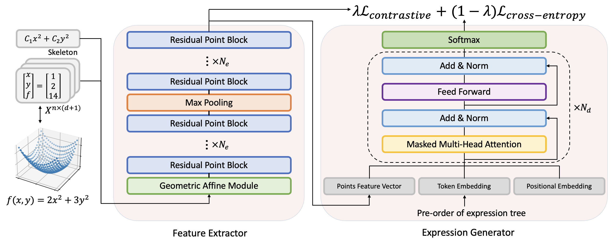

# T-JSL
<div align="center">
  
</div>




Este repositorio contiene la implementación oficial en PyTorch del artículo [***Transformer-based model for symbolic regression via joint supervised learning***](https://openreview.net/forum?id=ULzyv9M1j5) aceptado en ICLR'23. 

[](https://openreview.net/forum?id=ULzyv9M1j5)
[](#projects-using-Joint_Supervised_Learning_for_SR)


## 📦 Para comenzar

1. Instala Anaconda y crea un nuevo entorno

2. Instala los siguientes paquetes:

- Python >=3.6
- numpy
- sympy
- torch >= 1.1
- multiprocessing
- pickle
- h5py
- pathlib
- omegaconf
- tqdm
- gplearn
- glob
- json
- functools
- hydra
- transformers


### Obtención de conjuntos de datos

Primero, si deseas cambiar los valores predeterminados, configura el archivo `dataset_configuration.json`:

```
{
    "max_len": 20,
    "operators": "add:10,mul:10,sub:5,div:5,sqrt:4,pow2:4,pow3:2,pow4:1,pow5:1,log:4,exp:4,sin:4,cos:4,tan:4",
    "max_ops": 5,
    "rewrite_functions": "",
    "variables": ["x_1", "x_2"],
    "eos_index": 1,
    "pad_index": 0
}
```

### Generación de la base de esqueletos de expresiones

Puedes ejecutar este script para generar los esqueletos de expresiones:

```
python data_creation/dataset_creation.py --number_of_expressions NumberOfExpressions --no-debug #Replace NumberOfExpressions with the number of expressions you want to generate
```

### Generar conjuntos de datos con diferentes números de expresiones con distintas constantes

#### Generar conjunto de entrenamiento

Basado en el primer paso, puedes ejecutar `add_points_to_json.py` y establecer `number_per_equation` en el número de expresiones con constantes diferentes. El conjunto de datos se guardará como un archivo JSON. Cada muestra en el archivo contiene los puntos de datos, el esqueleto, la lista de recorrido de primer orden y la expresión en sí.

#### Generar conjunto de validación

Puedes seleccionar aleatoriamente 1000 esqueletos de expresiones de la base de esqueletos, luego asignar diferentes constantes ejecutando `add_points_to_json.py` y guardar el resultado como un archivo JSON.

#### Generar benchmark SSDNC

Ejecuta el siguiente script para generar el benchmark SSDNC:

```
python gen_SSDNC_benchmark.py
```


## 💻 Entrenamiento DDP

Puedes configurar `config.yaml` como desees. Si solo tienes una GPU, deberás comentar el código de DDP en `train_pytorch.py`.

Puedes ejecutar el siguiente script para entrenar el modelo:

```
CUDA_VISIBLE_DEVICES=0,1,2,3 python -m torch.distributed.launch --nproc_per_node=4 train_pytorch.py
```


## 🙏 Agradecimientos

Nuestra implementación se basa principalmente en los siguientes repositorios de código. Agradecemos profundamente a los autores por su excelente trabajo.

[SymbolicGPT](https://github.com/mojivalipour/symbolicgpt), [DSO](https://github.com/brendenpetersen/deep-symbolic-optimization), [NeSymReS](https://github.com/SymposiumOrganization/NeuralSymbolicRegressionThatScales), [gplearn](https://github.com/trevorstephens/gplearn), [PointMLP](https://github.com/ma-xu/pointMLP-pytorch)


## 🔗 Citando este trabajo

Si nuestro trabajo te resultó útil y utilizaste el código, por favor usa la siguiente cita:

```
@inproceedings{
li2023transformerbased,
title={Transformer-based model for symbolic regression via joint supervised learning},
author={Wenqiang Li and Weijun Li and Linjun Sun and Min Wu and Lina Yu and Jingyi Liu and Yanjie Li and Songsong Tian},
booktitle={The Eleventh International Conference on Learning Representations },
year={2023},
url={https://openreview.net/forum?id=ULzyv9M1j5}
}
```
