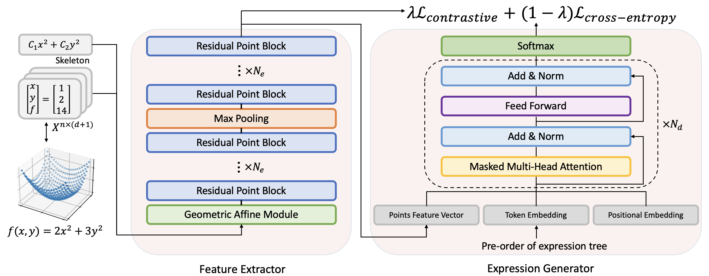

# T-JSL
<div align="center">
  
</div>




This repository contains the official Pytorch implementation for the paper [***Transformer-based model for symbolic regression via joint supervised learning***](https://openreview.net/forum?id=ULzyv9M1j5) accepted by ICLR'23. 

[](https://openreview.net/forum?id=ULzyv9M1j5)
[](#projects-using-Joint_Supervised_Learning_for_SR)


## 📦 Getting started

1. Install Anaconda and create a new environment

2. Install the following packages:

- Python >=3.6
- numpy
- sympy
- torch >= 1.1
- multiprocessing
- pickle
- h5py
- pathlib
- omegaconf
- tqdm
- gplearn
- glob
- json
- functools
- hydra
- transformers


### Getting datasets

First, if you want to change the defaults value, configure the `dataset_configuration.json` file:

```
{
    "max_len": 20,
    "operators": "add:10,mul:10,sub:5,div:5,sqrt:4,pow2:4,pow3:2,pow4:1,pow5:1,log:4,exp:4,sin:4,cos:4,tan:4",
    "max_ops": 5,
    "rewrite_functions": "",
    "variables": ["x_1", "x_2"],
    "eos_index": 1,
    "pad_index": 0
}
```

### Generate expressions skeletons base

You can run this script to generate expressions skeletons:

```
python data_creation/dataset_creation.py --number_of_expressions NumberOfExpressions --no-debug #Replace NumberOfExpressions with the number of expressions you want to generate
```

### Generate datasets with different numbers of expressions with different constants

#### Generate training set

Based on the first step, you can run `add_points_to_json.py` and set `number_per_equation` to the number of expressions with different constants. The dataset will be saved as a JSON file. Each sample in the file contains the data points, the skeleton, the first-order traversal list, and the expression itself.

#### Generate validation set

You can randomly select 1000 expression skeletons from the skeleton base, then assign different constants through running `add_points_to_json.py` and save it as a JSON file.

#### Generate SSDNC benchmark

Run following script to generate SSDNC benchmark:

```
python gen_SSDNC_benchmark.py
```


## 💻 DDP Training

You can configure the `config.yaml` as you choose. If you only have singe GPU, you will need to comment out the DDP code in `train_pytorch.py`.

You can run the following script to train the model:

```
CUDA_VISIBLE_DEVICES=0,1,2,3 python -m torch.distributed.launch --nproc_per_node=4 train_pytorch.py
```


## 🙏 Acknowledgment

Our implementation is mainly refers to the following codebases. We gratefully thank the authors for their wonderful works.

[SymbolicGPT](https://github.com/mojivalipour/symbolicgpt), [DSO](https://github.com/brendenpetersen/deep-symbolic-optimization), [NeSymReS](https://github.com/SymposiumOrganization/NeuralSymbolicRegressionThatScales), [gplearn](https://github.com/trevorstephens/gplearn), [PointMLP](https://github.com/ma-xu/pointMLP-pytorch)


## 🔗 Citing this work

If you found our work useful and used code, please use the following citation:

```
@inproceedings{
li2023transformerbased,
title={Transformer-based model for symbolic regression via joint supervised learning},
author={Wenqiang Li and Weijun Li and Linjun Sun and Min Wu and Lina Yu and Jingyi Liu and Yanjie Li and Songsong Tian},
booktitle={The Eleventh International Conference on Learning Representations },
year={2023},
url={https://openreview.net/forum?id=ULzyv9M1j5}
}
```


